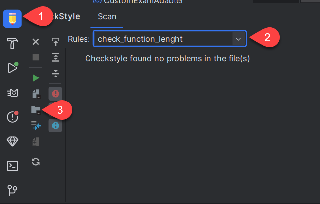

## Checkstyle - Setup environment
Plugin installieren "CheckStyle-IDEA" (File-> Settings -> Plugins -> in suche "CheckStyle-IDEA" eingeben -> installieren -> AndroidStudio neu starten)

5. Gewünschen Namen eingeben bsp. Custom Lenght Check
6. Datei unter "res/checkstyle/checkstyle.xml" auswählen

## Änderungen
- Paketdiagramm: neu ist das package service hinzugekommen, da für die Notification für kommende Prüfungen dies der schönste weg ist und in keinem bisherigen komponent platz hätte.

## Voraussetzungen
Benachrichtigungen müssen aktiviert werden für Notifications

Test device - Emulator: Pixle 7, UpsideDownCake 34